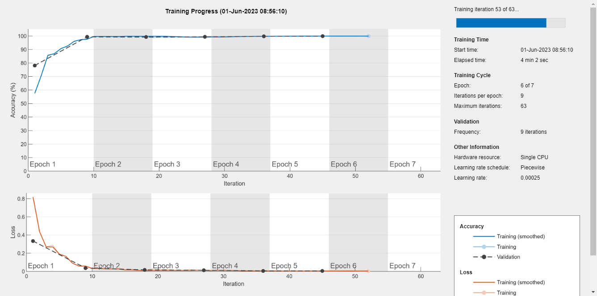
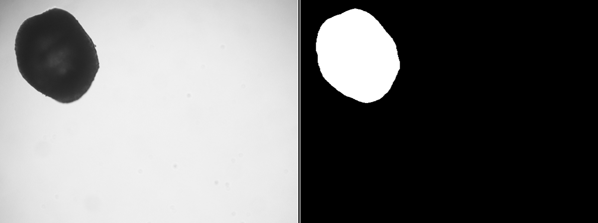
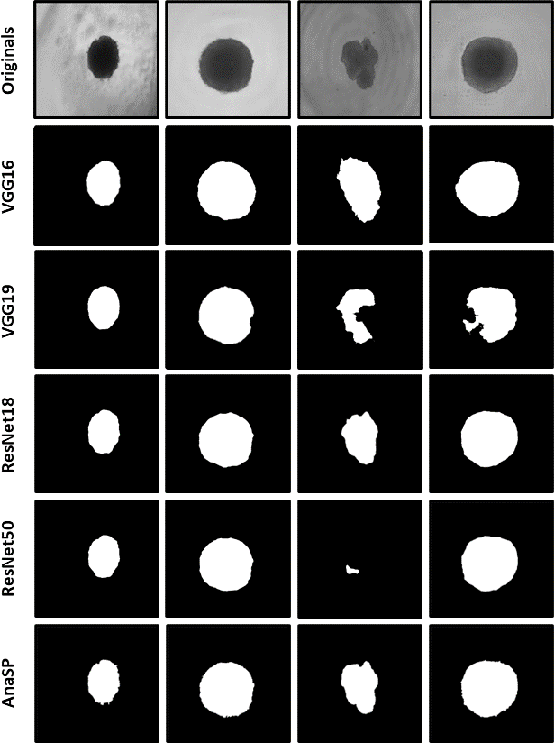
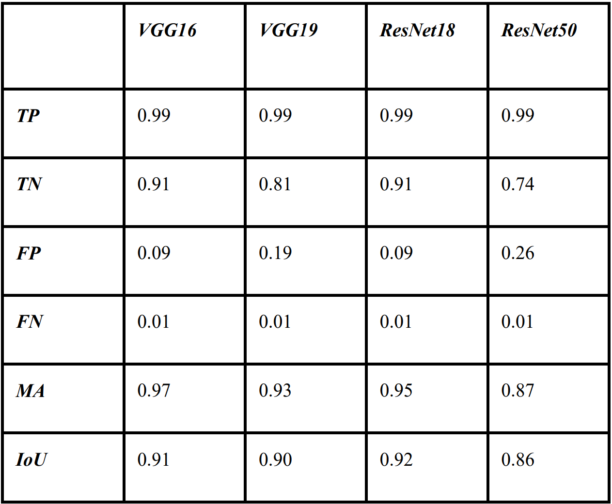
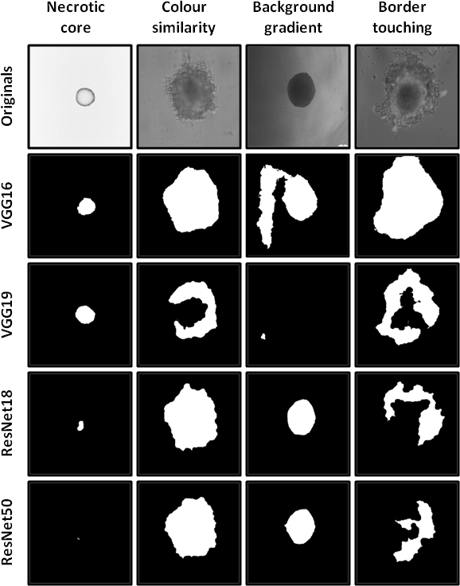

# SpheroidSegmentation_With_CNNs

This repository contains functions implemented in MATLAB for training various segmentation neural networks, performing spheroid segmentation using the trained neural networks and, evaluating the quality of the segmentation performed. 
This code is included in the AnaSP software, which is free to download at https://sourceforge.net/projects/anasp/. 
More about the first version of this tool, released for the first time in 2015, can be found in the article: F. Piccinini, “AnaSP: a software suite for automatic image analysis of multicellular spheroids.” Computer Methods and Programs in Biomedicine, 119(1):43-52, 2015. DOI: 10.1016/j.cmpb.2015.02.006.
The implemented segmentation networks that are trainable are VGG16, VGG19, ResNet18, ResNet50, and ResNet101. 

## Introduction

Today, more and more biological laboratories use 3D cell cultures and tissues grown in vitro as a 3D model of in vivo tumors and metastases. In the last decades, it has been extensively established that multicellular spheroids represent an efficient model to validate the effects of drugs and treatments for human care applications. However, a lack of methods for quantitative analysis limits the use of spheroids as models for routine experiments. Several methods have been proposed in the literature to perform high-throughput experiments employing spheroids by automatically computing different morphological parameters, such as diameter, volume, and sphericity. Nevertheless, these systems are typically grounded in expensive automated technologies that make the suggested solutions affordable only for a limited subset of laboratories that frequently perform high-content screening analyses. 
The aim of this project is to implement an automatic way to segment brightfield spheroid images acquired with a standard widefield microscope based on convolutional neural networks.
This automated method has been incorporated into the already existing AnaSP software, which is an open-source software suitable for automatically estimating several morphological parameters of spheroids. Its modular architecture and graphical user interface make it attractive for researchers who do not work in areas of computer vision and suitable for both high-content screenings and occasional spheroid-based experiments. 
  
## Repository Contents

- `ExampleImages` Folder containing 11 spheroids images in .tif format that are necessary to run the code.

- `ExampleMasks` Folder containing 11 manually segmented masks in .tif format that are necessary to run the code.

- `Images` Folder containing the images used in this README file.

- `gitattributes`

- `gitignore` containis file types that are not tracked by git.

- `FUNC.m` contains the function necessary for the main code.

- `Main.m` example of code that explains how to use the project.

- `metric_evaluation.m` contains the function responsible for evaluating the quality of the segmentation performed.

- `Network_Training.m` contains the function responsible fror training new segmentation neural networks.

- `ResNet101_Seg.m` contains the function responsible for generating the segmentation network based on the convolutional neural network ResNet101.

- `segmentation_multiple_images.m` contains the function responsible for performing the segmentation of spheroid images using the trained neural network.


## Installation

To clone the git repository, type the following commands from the terminal:

```         
git clone https: https://github.com/MariachiaraStellato/SpheroidSegmentation_With_CNNs
cd SpheroidSegmentation_With_CNNs
```

To run the functions used, it is necessary to have the deep learning toolbox installed on MATLAB. You can check if you already have it by writing in your MATLAB command line:

```         
ver('Deep Learning Toolbox')
```
If it is not installed, you can install and/or purchase it at the following link: 
https://it.mathworks.com/products/deep-learning.html.

It is also necessary to install some required packages. They can be found at the following links:

- VGG16: https://it.mathworks.com/matlabcentral/fileexchange/61733-deep-learning-toolbox-model-for-vgg-16-network

- VGG19: https://it.mathworks.com/matlabcentral/fileexchange/61734-deep-learning-toolbox-model-for-vgg-19-network

- ResNet18: https://it.mathworks.com/matlabcentral/fileexchange/68261-deep-learning-toolbox-model-for-resnet-18-network

- ResNet50: https://it.mathworks.com/matlabcentral/fileexchange/64626-deep-learning-toolbox-model-for-resnet-50-network

To test if all the functions are correctly working, you can write in the MATLAB command line: 

```         
results = runtests('tests');
```

## How to run
An example on how to use all the functions provided by this project is contained in the main.m file. 
This project is composed by three main parts: 
- Training
- Segmentation
- Validation

### Training
We can take a look at the code example for training images inside the main.m file: 

```
possible_net = ["VGG-16", "VGG-19", "ResNet-18","ResNet-50","ResNet101"];
ImagesDir = "ExampleImages";
MasksDir = "ExampleMasks";
PathTrainedNet = "TrainedNetworks"; %The directory where the trained network will be saved 
NetworkType = 5; %This correspond to the ResNet101 network
Choosen_Net = possible_net(NetworkType);
net = Network_Training(ImagesDir, MasksDir, NetworkType);
T = datestr(now,'dd-mm-yy-HH-MM-SS');       
netname = [char(Choosen_Net),'_',T]; 
netdir = fullfile(PathTrainedNet,netname);
save(netdir,'net');
msgbox('TRAINING: THE END.', 'Message');

```
You must choose the path of the folder containing the images (`ImagesDir`) and the masks (`MasksDir`) you intend to use for the training. Then you can choose the forlder where you need your trained network to be saved, writing the path as the `PathTrainedNet` variable. 
Finally you have to choose the right index for the network you want to train: 
- '1' : VGG-16
- '2' : VGG-19
- '3' : ResNet-18
- '4' : ResNet-50
- '5' : ResNet-101

Once all the necessary variables are correctly defined, the code is ready to be run. The training can take from few minutes to few hours to complete, but you wll be able to follow the progression of the training by looking at the Training Progress plot that will appear during the training. 



After the training, the obtained DAGNetwork variable will be saved into the `PathTrainedNet` with a unique file name defined by the type of network choosen and the date and time of the training. 

### Segmentation
We can take a look at the code example that can be used to segment the spheroid images inside the main.m file: 

```
PathImageFolder = "ExampleImages";
PathImageFolderOut = "SegmentedMasks";
PathNetworkFolderInp = "TrainedNetworks\segRes18Net.mat";
SpecificImageName ='none';
flag_ShowMask = 1;
segmentation_multiple_images(PathImageFolder,PathImageFolderOut,PathNetworkFolderInp,SpecificImageName,flag_ShowMask);

```
The `segmentation_multiple_images` function will take the folder containing the images you want to segment, `PathImageFolder`, the folder in which the segmented shperoids will be saved, `PathIMageFolderOut`, the path where the trained network you want to use is contained, `PathNetworkFolderInp`, and perform the segmentation. 
Warning: The saved binary images will have the exact same name of the input images, so it is crucial to save them in a different folder than the one where the original image are to avoid overwriting. 

If the `SpecificImageName` is defined as 'none' the whole folder will be segmented. You can define it as the name of a specific image inside the `PathImageFolder` in order to segment only that specific image. 
If the `flag_ShowMask` is defined as the integer number 1 than every mask will be plotted aligned with the original image as shown in the following picture. Else the segmentation won't show during the progression of the code. 



To continue with the segmentation you have to clic "Enter" on the plot. It will be automatically closed and the next image will be segmented. 

### Validation
We can take a look at the code example for validating the segmentation obtained by one or more trained networks inside the main.m file: 

```
TestMaskDir = "ExampleMasks";
SegmentedMaskDir = "SegmentedMasks";
metrics = metric_evaluation(TestMaskDir, SegmentedMaskDir);

```
The `metric_evaluation` function will take as inputs the folder containing the manually segmented masks, considered as ground truth, (`TestMaskDir`) and the folder containing the masks segmented using the neural network you want to evaluate (`SegmentedMaksDir`) and calculate various metrics to assess the network quality. 
The variable `metrics`, that is a SemanticSegmentationMetrics structure, will contain the confusion matrix, the normalized confusion matrix, the dataset metrics, class metrics and images metrics. 
In particular the dataset metrics, class metrics, and image metrics contain the global accuracy, mean accuracy, mean and weighted intersection over union, and mean BF score. All these measures have the purpose of evaluating the quality of the segmentation with respect to the ground truth. 

## Results 
In the `TrainedNetworks` folder are presented some already trained networks that are ready to se to perform spheroid segmentation. These were trained over a set of approximately 10,000 2048x2048 RGB spheroid images and relative masks. The dataset was divided into 3 subsets: (a) the training set (80% of the total images); (b) the validation set (10% of the total images); and (c) the test set (10% of the total images). To reduce computational efforts, all the input images were rescaled to 8-bit gray-level 500x500 pixels, and the masks were internally binary labeled into 2 categories: background and foreground (i.e., the spheroid). Due to the dimension of the dataset, it was not uploaded in this repository, so this training cannot be reproduced. However, the example images and masks provide for a small batch of images that the user can download to test this results. 

The masks obtained with the 4 trained networks were compared with the segmentations obtained using AnaSP 1.0. In the following picture a small sample of the confronted segmentation is presented. 



Among the many metrics, the normalized confusion matrices, mean accuracy (MA) and interection over union (IoU) of the dataset were used to quantitatively confront the trained networks.



The normalized confusion matrix is presented in this table by giving on the first four rows the values contained in each matrix cell: the true positive (TP), true negative (TN), false positiva (FP) and false negative (FN). We want TP and TN to be as high as possible, because they represent those pixel that have been assigned to the same class in both the segmentation done by using the trained networks and the manually segmented images (ground truth). On the other end we want the FP and FN to be as low as possible because these categories represent the pixel that have been misclassified by our segmentation.  

From the table above we can say that VGG16 and ResNet-18 were the most reliable networks. Going more in depth with the analysis of the results, we can observe that in specific cases, such as spheroids with a necrotic core, dishomogeneity in the background and border touching spheroids, the trained networks tend to perform worse. 



From this in depth qualitative analysis we can say that the best performing network is ResNet-18, due to the fact that it is the least affected by the specific problematic cases observed. 

All the images used in this paragraph and a more in depth analysis can be found in the related article: F. Piccinini, A. Peirsman, M. Stellato, J. Pyun, M. M. 
Tumedei, M. Tazzari, O. De Wever, A. Tesei, G. MAartinelli and G. Castellani: “DEEP LEARNING-BASED TOOL FOR MORPHOTYPIC ANALYSIS OF 3D MULTICELLULAR SPHEROIDS.” Journal of Mechanics in Medicine and Biology, DOI: https://doi.org/10.1142/S0219519423400341.
